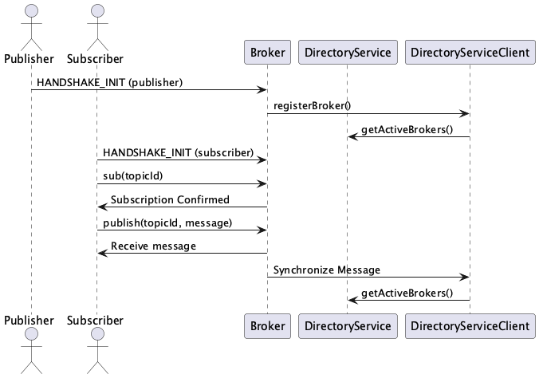
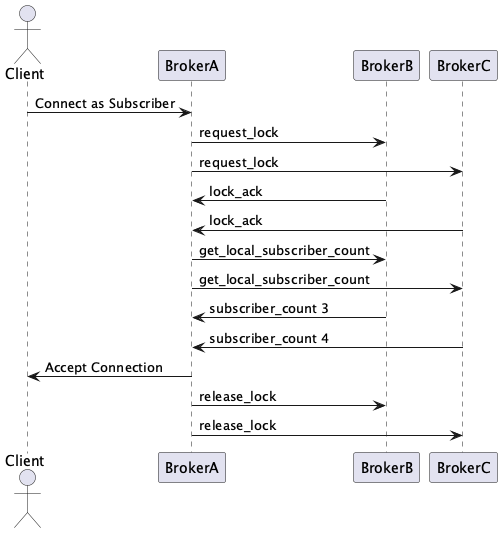

# My Pub-Sub System

This project is a simple Publish-Subscribe (Pub-Sub) system implemented in Java. It allows multiple brokers to communicate with each other, publishers to create topics and publish messages, and subscribers to subscribe to topics and receive published messages. The system uses TCP for communication.

## Prerequisites

- Java 8 or higher
- Terminal or command prompt to run the JAR files

## How to Build the Project

1. Clone the repository or download the source code.
2. Compile the code and package it into JAR files (for `broker`, `publisher`, and `subscriber`) using your preferred method. You can use an IDE like IntelliJ or Eclipse, or use `javac` and `jar` commands directly.

## How to Run

Make sure you have built `broker.jar`, `publisher.jar`, and `subscriber.jar` files.

### Step 1: Start the Broker

Open a terminal and start the broker by specifying a port number. Optionally, you can connect to another broker by providing the IP and port of an existing broker.

```bash
# Start Broker on port 12345
java -jar jars/broker.jar 12345

# Start another Broker on port 12346 and connect it to the broker at 12345
java -jar jars/broker.jar 12346 localhost 12345
```

### Step 2: Start the Publisher

In a new terminal, start a publisher and connect it to the broker.

```bash
# Connect publisher to Broker on port 12345
java -jar jars/publisher.jar localhost 12345
```

The publisher can issue commands such as:

- **Create a Topic**: `create <topic_id> <topic_name>`
- **Publish a Message**: `publish <topic_id> <message>`

Example commands:

```bash
create topic1 "First Topic"
publish topic1 "Hello, Subscribers!"
```

### Step 3: Start the Subscriber

In another terminal, start a subscriber and connect it to a broker.

```bash
# Connect subscriber to Broker on port 12346
java -jar jars/subscriber.jar localhost 12346 subscriber1
```

The subscriber can issue commands such as:

- **Subscribe to a Topic**: `sub <topic_id>`
- **Unsubscribe from a Topic**: `unsub <topic_id>`
- **List All Topics**: `list all`
- **View Current Subscriptions**: `current`

Example commands:

```bash
sub topic1
unsub topic1
list all
current
```

## Notes

- **Ensure that Subscribers subscribe to topics before Publishers publish messages**: This version does not store messages for later delivery; only active subscribers receive messages.
- **Broker Inter-connection**: When brokers connect to each other, they should add each other's sockets to their `connectedBrokers` list. This ensures that published messages are shared across all connected brokers.
- **Avoiding Infinite Loops**: The system includes logic to prevent brokers from repeatedly reconnecting to each other.

## Example Workflow

1. **Start two brokers:**

   ```bash
   java -jar jars/broker.jar 12345
   java -jar jars/broker.jar 12346 localhost 12345
   ```

2. **Start a publisher connected to the first broker:**

   ```bash
   java -jar jars/publisher.jar localhost 12345
   ```

3. **Start a subscriber connected to the second broker:**

   ```bash
   java -jar jars/subscriber.jar localhost 12346 subscriber1
   ```

4. **In the publisher terminal, create a topic and publish a message:**

   ```bash
   create topic1 "My First Topic"
   publish topic1 "Hello to all subscribers!"
   ```

With these steps, you should see the subscriber receiving the message through the connected brokers.

## System Diagrams

### Interaction Diagram



This diagram illustrates the interactions between the Publisher, Subscriber, Broker, and Directory Service during message exchange and broker synchronization.

### Class Design


This diagram presents the class structure of the system, showing the relationships between components like `Broker`, `PublisherApp`, `SubscriberApp`, `ClientHandler`, and `DirectoryServiceClient`.

### Distributed Lock Mechanism



This diagram depicts the locking mechanism used to coordinate subscriber connections and prevent race conditions across multiple brokers.
